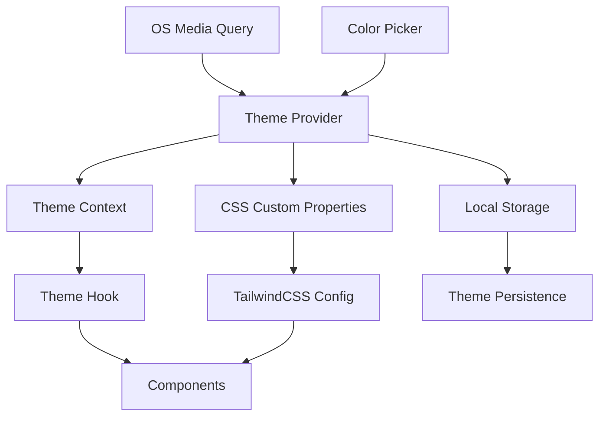

# Theme and Color System Design

## Overview

The theme and color system will provide a comprehensive theming solution for the Lynx React application, integrating seamlessly with the existing TailwindCSS setup. The system will support three theme modes (system, light, dark) and dynamic color scheme customization through CSS custom properties and React context.

## Architecture

### High-Level Architecture



### Component Structure

- **ThemeProvider**: Root context provider managing theme state
- **ThemeToggle**: UI component for switching theme modes
- **ColorPicker**: UI component for selecting custom colors
- **useTheme**: Custom hook for accessing theme functionality
- **CSS Custom Properties**: Dynamic color variables
- **TailwindCSS Integration**: Extended configuration for theme-aware utilities

## Components and Interfaces

### 1. Theme Context and Provider

```typescript
interface ThemeContextType {
  mode: 'system' | 'light' | 'dark';
  resolvedMode: 'light' | 'dark';
  customColor: string;
  setMode: (mode: 'system' | 'light' | 'dark') => void;
  setCustomColor: (color: string) => void;
}

interface ThemeProviderProps {
  children: React.ReactNode;
  defaultMode?: 'system' | 'light' | 'dark';
  defaultCustomColor?: string;
}
```

### 2. Theme Hook

```typescript
interface UseThemeReturn {
  mode: 'system' | 'light' | 'dark';
  resolvedMode: 'light' | 'dark';
  customColor: string;
  setMode: (mode: 'system' | 'light' | 'dark') => void;
  setCustomColor: (color: string) => void;
  toggleMode: () => void;
}
```

### 3. Color System

The system will use HSL color space for better color manipulation and generate color palettes based on the custom color selection:

```typescript
interface ColorPalette {
  primary: string;
  primaryLight: string;
  primaryDark: string;
  secondary: string;
  accent: string;
  background: string;
  surface: string;
  text: string;
  textSecondary: string;
}
```

## Data Models

### Theme Configuration

```typescript
interface ThemeConfig {
  mode: 'system' | 'light' | 'dark';
  customColor: string;
  colorPalette: ColorPalette;
  preferences: {
    animationDuration: number;
    persistTheme: boolean;
  };
}
```

### CSS Custom Properties Structure

The system will define CSS custom properties for consistent theming:

```css
:root {
  /* Base colors */
  --color-primary: hsl(var(--primary-hsl));
  --color-primary-light: hsl(var(--primary-light-hsl));
  --color-primary-dark: hsl(var(--primary-dark-hsl));
  
  /* Semantic colors */
  --color-background: hsl(var(--background-hsl));
  --color-surface: hsl(var(--surface-hsl));
  --color-text: hsl(var(--text-hsl));
  --color-text-secondary: hsl(var(--text-secondary-hsl));
  
  /* Theme-specific values */
  --primary-hsl: 220 100% 50%;
  --background-hsl: 0 0% 100%;
  --text-hsl: 0 0% 0%;
}

[data-theme="dark"] {
  --background-hsl: 0 0% 10%;
  --text-hsl: 0 0% 100%;
}
```

## Implementation Strategy

### 1. CSS Custom Properties Integration

- Extend TailwindCSS configuration to use CSS custom properties
- Create theme-aware color utilities that reference custom properties
- Implement smooth transitions between theme changes

### 2. React Context Implementation

- Create ThemeProvider component wrapping the entire application
- Implement useTheme hook for component-level theme access
- Handle system preference detection and changes

### 3. Color Generation Algorithm

- Use HSL color space for mathematical color manipulation
- Generate complementary and analogous colors from custom color
- Ensure sufficient contrast ratios for accessibility

### 4. Persistence Layer

- Store theme preferences in localStorage
- Implement fallback to system preferences
- Handle hydration issues in SSR environments

## TailwindCSS Integration

### Extended Configuration

```javascript
// tailwind.config.js extension
module.exports = {
  content: ['./src/**/*.{js,jsx,ts,tsx}'],
  presets: [require('@lynx-js/tailwind-preset-canary')],
  theme: {
    extend: {
      colors: {
        primary: 'hsl(var(--primary-hsl) / <alpha-value>)',
        'primary-light': 'hsl(var(--primary-light-hsl) / <alpha-value>)',
        'primary-dark': 'hsl(var(--primary-dark-hsl) / <alpha-value>)',
        background: 'hsl(var(--background-hsl) / <alpha-value>)',
        surface: 'hsl(var(--surface-hsl) / <alpha-value>)',
        'text-primary': 'hsl(var(--text-hsl) / <alpha-value>)',
        'text-secondary': 'hsl(var(--text-secondary-hsl) / <alpha-value>)',
      },
      transitionProperty: {
        'theme': 'background-color, border-color, color, fill, stroke',
      },
    },
  },
  plugins: [],
  darkMode: ['class', '[data-theme="dark"]'],
};
```

### Theme-Aware Utilities

The system will provide utilities that automatically adapt to the current theme:

- `bg-theme-background` - Dynamic background color
- `text-theme-primary` - Dynamic primary text color
- `border-theme-primary` - Dynamic primary border color
- `bg-theme-primary` - Dynamic primary background color

## Error Handling

### Theme Loading Errors

- Graceful fallback to system theme if custom theme fails to load
- Error boundaries around theme-dependent components
- Validation of custom color inputs

### Browser Compatibility

- Feature detection for CSS custom properties
- Fallback colors for unsupported browsers
- Progressive enhancement approach

### Performance Considerations

- Debounced color updates to prevent excessive re-renders
- Memoized color calculations
- Efficient CSS custom property updates

## Testing Strategy

### Unit Tests

- Theme context provider functionality
- Color generation algorithms
- Theme persistence logic
- Custom hook behavior

### Integration Tests

- Theme switching across components
- CSS custom property updates
- TailwindCSS integration
- Local storage persistence

### Visual Regression Tests

- Theme appearance consistency
- Color contrast validation
- Animation smoothness
- Cross-browser compatibility

## Accessibility Considerations

### Color Contrast

- Ensure WCAG AA compliance for all color combinations
- Automatic contrast ratio validation
- High contrast mode support

### Reduced Motion

- Respect `prefers-reduced-motion` media query
- Optional animation disabling
- Instant theme switching option

### Screen Readers

- Proper ARIA labels for theme controls
- Semantic HTML structure
- Focus management during theme changes

## Migration Strategy

### Existing Styles

- Gradual migration of existing color classes
- Backward compatibility with current TailwindCSS usage
- Non-breaking changes to existing components

### Component Updates

- Update existing components to use theme-aware utilities
- Maintain existing functionality while adding theme support
- Progressive enhancement approach